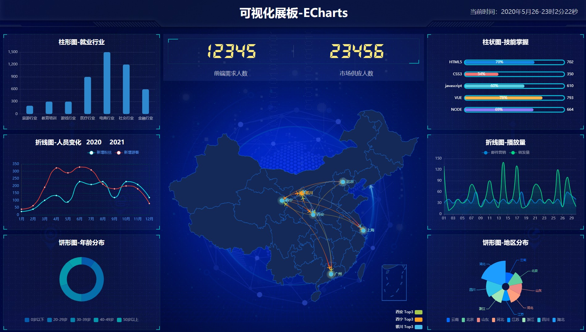

<!--
 * @Descripttion: 
 * @version: 
 * @Author: qiaoyurensheng@163.com
 * @Date: 2020-05-26 22:57:31
 * @LastEditors: Please set LastEditors
 * @LastEditTime: 2020-05-26 23:04:02
--> 
## echarts 的学习练习demo
本项目是使用 echarts 开源可视化库制作的一个小demo，通过本项目，学会了echarts 的相关语法和基本使用，了解了柱状图、折线图和饼状图的使用，强化了页面布局知识，提升了自己的水平。
